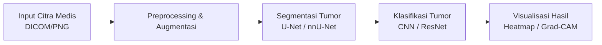

# Memory & Riwayat Proyek: Medical Imaging Tumor Detection Pipeline Builder

Dokumen ini berfungsi sebagai memori konteks, catatan riwayat, dan panduan teknis proyek **Medical Imaging Tumor Detection**.

---

## 1. Profil Proyek & Konteks

- **Topik Proyek**: *Medical Imaging Tumor Detection Pipeline Builder* (Deteksi dan Klasifikasi Tumor Berbasis Citra Medis).
- **Referensi Aplikasi**: [PartyRock AWS App](https://partyrock.aws/u/suzirz/YELxYsuey/Medical-Imaging-Tumor-Detection-Pipeline-Builder)
- **Tujuan Utama**: Membantu praktisi citra medis (radiologi/AI engineer) merancang alur kerja (pipeline) dari pengolahan data scan medis hingga inferensi model AI (CNN/Deep Learning).

---

## 2. Bedah Konsep: Apa itu "Medical Imaging Tumor Detection Pipeline Builder"?

Secara sederhana, ini adalah **alur kerja otomatisasi (pipeline)** untuk membaca citra medis (seperti MRI, CT scan, atau X-Ray), mendeteksi apakah ada tumor, dan mengklasifikasikan jenis atau tingkat keganasannya.

### Alur Kerja (Pipeline) Standar:

1. **Input Data Medis**:
   - Format umum: DICOM (`.dcm`), NIfTI (`.nii`), atau format gambar standar (`.png`, `.jpg`).
   - Jenis citra: MRI otak, CT scan paru-paru, mammogram payudara, dll.

2. **Preprocessing (Pembersihan Citra)**:
   - *Resizing* & normalisasi intensitas piksel.
   - *Noise reduction* (penghapusan derau).
   - Augmentasi data (rotasi, flip, brightness) agar AI tidak overfitting.

3. **Segmentasi (Menentukan Letak & Bentuk Tumor)**:
   - Model seperti **U-Net** atau **nnU-Net** menandai piksel mana yang merupakan jaringan tumor vs jaringan sehat.

4. **Klasifikasi (Menentukan Jenis Tumor)**:
   - Menggunakan CNN (misal ResNet, EfficientNet, Vision Transformer).
   - Menjawab: Jinak (*benign*) vs Ganas (*malignant*), atau menentukan tipe/stadium tumor.

5. **Explainability & Pelaporan (XAI)**:
   - Menghasilkan heatmap (Grad-CAM) untuk dokter melihat bagian gambar mana yang menjadi dasar pertimbangan AI.

---

## 3. Peran Aplikasi di PartyRock AWS

- **Platform**: PartyRock adalah arena no-code/generative AI berbasis AWS Bedrock.
- **Fungsi Aplikasi Tersebut**:
  - Berfungsi sebagai **simulator / konsultan interaktif**.
  - Pengguna memasukkan spesifikasi (misal: "Saya ingin deteksi tumor otak dari MRI T1-weighted").
  - AI di PartyRock memberikan rekomendasi arsitektur CNN, teknik preprocessing, hyperparameter, dan kode/pipeline implementasi.

---

## 4. Log Interaksi & Keputusan (Riwayat Chat)

| Tanggal | Aktivitas / Permintaan | Hasil & Keputusan |
|---|---|---|
| 2026-09-24 | Permintaan pembuatan file memory/riwayat dan penjelasan link PartyRock AWS | File `CHAT.md` dibuat; materi PartyRock dan pipeline CNN medis dijelaskan secara runtut. |

---

## 5. Rencana & Next Steps (Bisa Diadaptasi Sesuai Kebutuhan)

- [ ] Menentukan studi kasus spesifik (contoh: Tumor Otak Brain MRI, Kanker Paru CT Scan, dll.).
- [ ] Menyiapkan dataset terbuka (misal dari Kaggle: Brain MRI Segmentation Dataset).
- [ ] Membuat prototype script Python (PyTorch / TensorFlow) untuk data loader dan model baseline.
