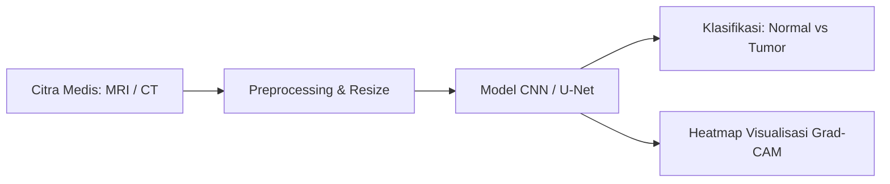

# 🩺 Medical Imaging Tumor Detection Pipeline Builder

Sistem deteksi dan segmentasi tumor berbasis Deep Learning (CNN & U-Net) untuk citra medis (Brain MRI, CT Scan, X-Ray). Proyek ini mengimplementasikan konsep perancangan alur kerja (*pipeline*) analisis citra medis dari input gambar, preprocessing, klasifikasi, hingga visualisasi Explainable AI (Grad-CAM).

---

## 🌟 Fitur Utama

- **Pipeline Preprocessing Standar**: Normalisasi citra medis, penyesuaian dimensi piksel, dan tensor transform.
- **Arsitektur Model CNN & U-Net**:
  - `SimpleMedicalCNN`: Arsitektur klasifikasi deteksi tumor vs normal dengan Convolutional layers, Batch Normalization, dan Dropout.
  - `UNetLite`: Arsitektur segmentasi semantik untuk menandai batas area jaringan tumor.
- **Demo Web Interaktif (Streamlit)**: Antarmuka ramah pengguna untuk mengunggah gambar scan medis, mengatur threshold sensitivitas, dan melihat hasil diagnosa serta visualisasi heatmap (XAI).
- **Training Script Mandiri**: Dilengkapi generator data sintetis (`SyntheticMedicalDataset`) sehingga bisa langsung diuji coba latihan tanpa harus mengunduh dataset puluhan GB terlebih dahulu.

---

## 📁 Struktur Direktori

```text
├── CHAT.md             # Dokumen memori & riwayat diskusi proyek
├── README.md           # Panduan lengkap proyek
├── requirements.txt    # Daftar dependensi library Python
├── .gitignore          # File pengecualian git (cache, checkpoint model, venv)
├── app.py              # Aplikasi demo web interaktif (Streamlit)
└── src/
    ├── models.py       # Arsitektur PyTorch (CNN Classifier & U-Net Segmenter)
    ├── pipeline.py     # Fungsi utilitas preprocessing citra & heatmap XAI
    └── train.py        # Skrip pelatihan model (Training loop)
```

---

## 🚀 Cara Menjalankan

### 1. Buat Virtual Environment & Install Dependensi

```bash
# Buat virtual environment
python -m venv venv

# Aktifkan virtual environment (Windows PowerShell)
.\venv\Scripts\Activate.ps1

# Install dependensi
pip install -r requirements.txt
```

### 2. Melatih Model (Opsional)

Untuk mencoba proses pelatihan model CNN:
```bash
python src/train.py
```

### 3. Menjalankan Web Demo Interaktif (Streamlit)

Jalankan server aplikasi web:
```bash
streamlit run app.py
```
Buka browser di `http://localhost:8501` untuk mencoba mengunggah foto scan dan melihat hasil deteksinya.

---

## 💡 Konsep Pipeline



---

## 📄 Lisensi
MIT License.
